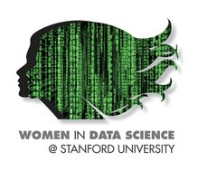

## WiDS Datathon

_____

 

  

 

This is my python solution for the WiDS Datathon, which is a new feature of the WiDS conference 2018. You can read about the datathon [Here](http://www.widsconference.org/datathon.html). This competition is launched by [kaggle](https://www.kaggle.com/c/wids2018datathon).

 

The dataset includes demographic and behavioral information from a sample of survey from India, related to their usage of financial services. The goal of this project is to predict gender, exploring the key differences in behavior patterns between men and women. By doing so, this competition seeks to encourage female data scientists to engage in social impact solutions and to help the poor people. Especially, InterMedia, where provide the dataset, seeks to help the world's poorest people take advantage of mobile phones/digital technoglogy to participate fully in their local economies.

 

### Data

** I only uploade WiDS data dictionary v2.xlsx due to limitation of file size. You can download the input files via [kaggle](https://www.kaggle.com/c/wids2018datathon).

- train.csv : training data (18255 rows, 1235 columns)

- test.csv : test data (27285 rows, 1234 columns)

- WiDS data dictionary v2.xlsx : feature descriptions dictionary

 

### Target variables

- <b>is_female</b> : is_female=1 for female and is_female=0 for male (while is_female=2 for female and is_female=1 for male in the dictionary table)

 

### Model - [Xgboost](http://xgboost.readthedocs.io/en/latest/python/python_intro.html)

To verify your installation, try to import xgboost in Python:

 

    import xgboost as xgb

 

 

 

 

### Result files

- final_code.ipynb : Jupyter Notebook file for modeling

- data_exploration.pdf : this file has plots of most of features (~810) except the features with primarily NaN values. The y-axis gives the average "is_female" values for each answer for each feature.

 
